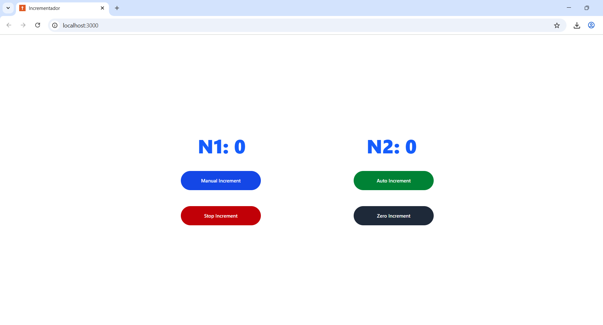

# 🔢 Incrementador com Animações em React + TypeScript


Este projeto é uma aplicação de contador com incremento manual e automático, desenvolvida com **React**, **TypeScript** e **TailwindCSS**, utilizando a estrutura de diretórios do **App Router (Next.js)**. Conta com animações suaves para cliques em botões e gerenciamento de estado com hooks personalizados.

---

## 🚀 Funcionalidades

- ✅ Incremento manual com atraso controlado
- ✅ Incremento automático contínuo
- ✅ Botão para zerar os valores (N1 e N2)
- ✅ Parar incremento automático
- ✅ Animações com `scale` nos botões pressionados
- ✅ Layout responsivo e tema dark habilitado

---

## 🖼️ Preview da Interface



---

## 🛠️ Tecnologias Utilizadas

- [React](https://reactjs.org/)
- [TypeScript](https://www.typescriptlang.org/)
- [TailwindCSS](https://tailwindcss.com/)
- [Next.js (App Router)](https://nextjs.org/docs/app)

---

## ▶️ Como Executar Localmente

1. **Clone o repositório:**

```bash
git clone https://github.com/MaiconMJS/incrementador-react.git
```
